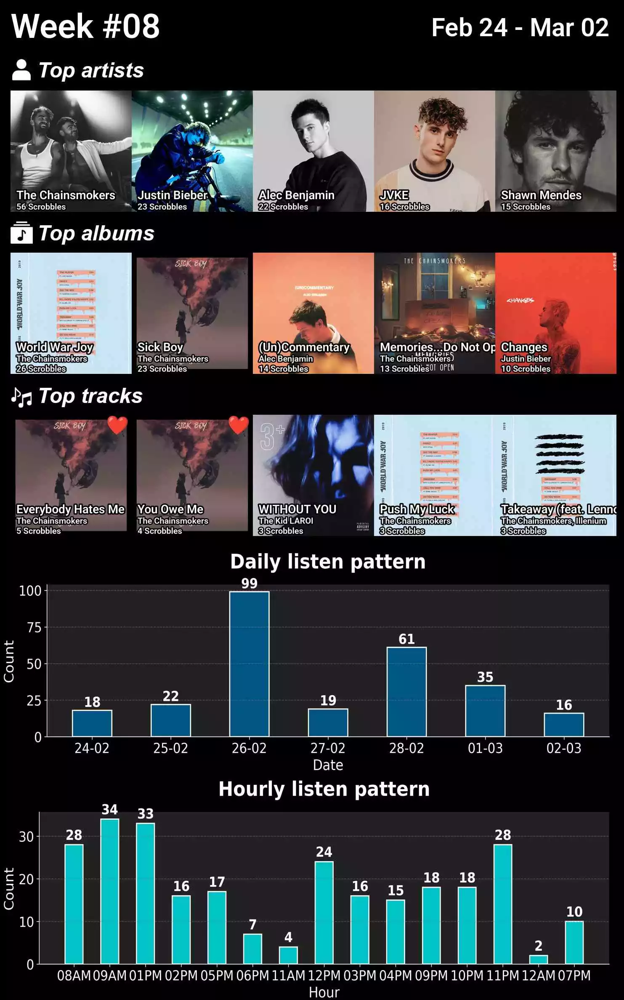
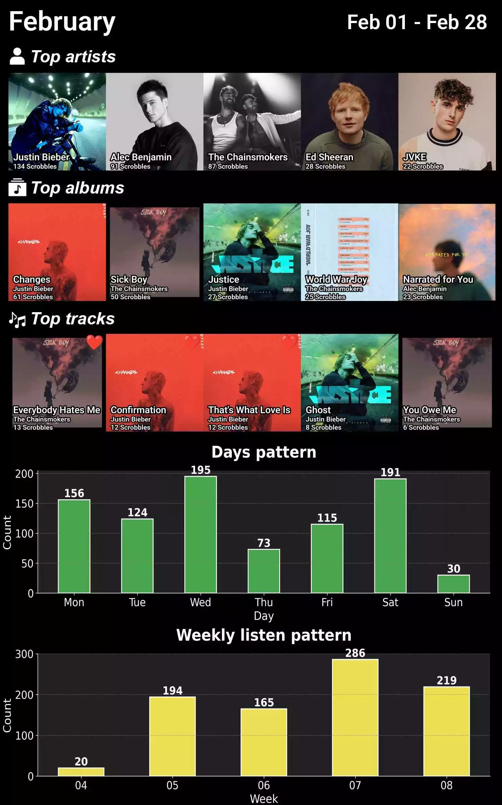
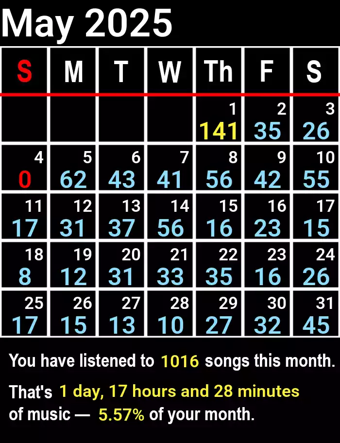
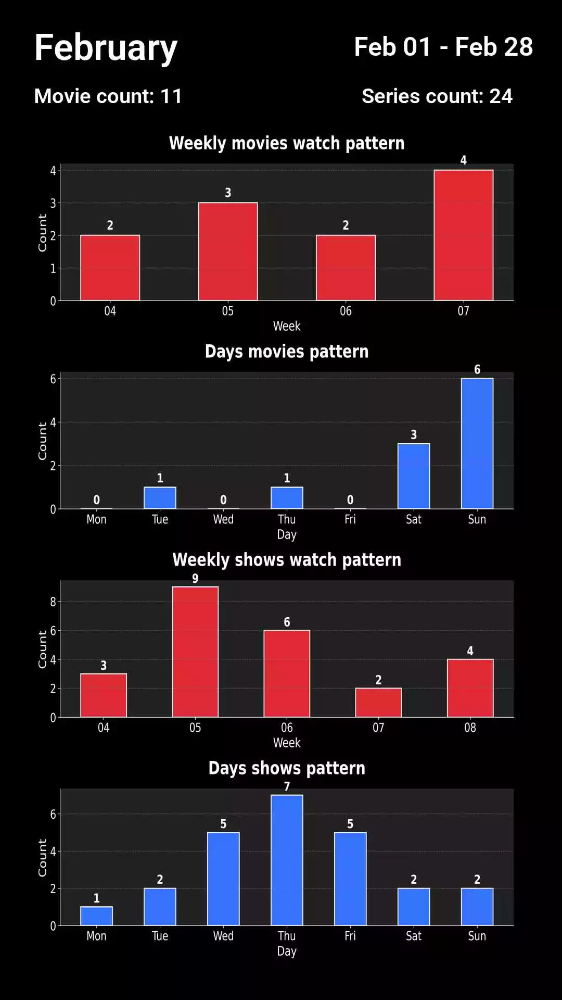

# Stats Collage

Creates a collage, on weekly/monthly bases, of your stats from sources like:

* [LastFM](https://www.last.fm/) - Music
* [Trakt](https://trakt.tv/) - Movies & Series

and sends it to your telegram channel

## 📸 Final output

    
LastFM - Weekly

    

    
LastFM - Monthly

      
    

    
Trakt - Monthly - Chart

    

## 🔗 Stats profile

## 🤵Visitor count

## 🔗 My contacts

## 📚 Acknowledgements
 - [Icons - Flaticon](https://www.flaticon.com/)
 - [Emoji - googlefonts/noto-emoji](https://github.com/googlefonts/noto-emoji/blob/main/png/128/emoji_u2764.png)
 - [Font - Google fonts (Roboto)](https://fonts.google.com/specimen/Roboto?preview.text=never%20gonna%20give%20you%20up)
 - [Readme - Readme editor](https://readme.so/)

